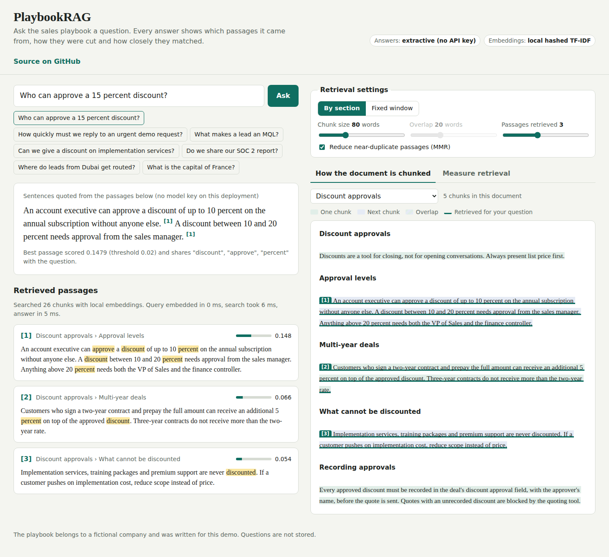

# PlaybookRAG

Retrieval-augmented answers over a sales playbook, with every stage of retrieval visible: how documents are chunked, how passages score, why a question is refused, and how well retrieval performs on a labelled question set.

**Live demo:** _add your Vercel URL here_



## The problem

Sales reps ask RevOps the same questions every week: who approves a 15% discount, how fast an urgent lead must be called, what counts as an MQL. The answers exist in a playbook nobody reads. A chatbot that answers from the model's general knowledge will confidently invent a discount policy. The requirement is narrower: answer only from the playbook, show where the answer came from, and say "not covered" when it is not.

## How I approached it

Most RAG demos hide retrieval behind an answer. Retrieval is where these systems fail, so this one makes it inspectable and measurable.

**1. Chunking, two strategies.**
- *Fixed window:* N words with O words of overlap. Predictable, but cuts rules in half.
- *By section:* split on headings, then paragraphs, then sentences, packing up to N words. Each chunk's heading path ("Discount approvals > Approval levels") is prepended before embedding, so a short chunk keeps its context.

The chunk viewer draws each chunk as a band over the source document, with overlaps hatched and retrieved chunks underlined.

**2. Embeddings.** With no key, a local hashed TF-IDF embedding: normalised unigrams and bigrams hashed into 16,384 signed dimensions, weighted by (1 + log tf) × idf, L2-normalised. I measured collision noise at 1,024 and 4,096 dimensions: off-topic questions scored as high as real ones. At 16,384 they mostly score zero. With `OPENAI_API_KEY`, `text-embedding-3-small` is used through the same interface.

**3. Vector store and search.** A flat in-memory index with exact cosine similarity (a dot product on normalised vectors). At tens to thousands of chunks, brute force is exact and fast. **MMR** (maximal marginal relevance, λ = 0.7) re-ranks the top candidates so overlapping chunks from the same passage do not take every slot.

**4. Relevance guard.** With lexical embeddings, a question is answered only if the best passage scores above a threshold **and** shares at least one real word with the question. The second check removes matches caused purely by hash collisions. Refusals skip generation entirely, so there is nothing to hallucinate.

**5. Generation.** With `ANTHROPIC_API_KEY`, Claude answers from the numbered passages only and cites them. Without it, an extractive fallback quotes the two sentences with the most query-term overlap, in reading order, with citations. The UI labels which mode produced the answer.

**6. Evaluation.** Twelve questions with a known answer section are run through both strategies. With the defaults (80-word chunks, 20-word overlap, top 3, MMR, local embeddings):

| Strategy | Chunks | Hit@3 | MRR |
|---|---|---|---|
| Fixed window | 17 | 11 / 12 | 0.875 |
| By section | 26 | 11 / 12 | 0.917 |

The misses are paraphrases. "Where do leads from Dubai get routed?" needs "Dubai" to match "UAE and the GCC", which word-based embeddings cannot do. That is the concrete case for semantic embeddings, and the evaluation makes it visible instead of anecdotal.

**Known limitation, pinned by a test:** "Who won the cricket match yesterday?" gets past the lexical guard, because "won" (closed won) and "match" (matches our ICP) appear in the playbook.

## Run it

```bash
npm run dev      # http://localhost:3000, no install needed (Node 20+)
npm test         # chunk overlap and boundaries, MMR, answers, refusals, evaluation floor
```

| Variable | Effect |
|---|---|
| `ANTHROPIC_API_KEY` | Answers are generated by Claude from retrieved passages (`LLM_MODEL` to change the model). |
| `OPENAI_API_KEY` | Semantic embeddings with `text-embedding-3-small`; the guard switches to a score-only threshold. |

Deploy: import the repo in Vercel. `public/` is static and `api/` holds the functions; no build step. Indexes are built on first request and cached per settings in the function instance.

## What I would improve next

1. **Semantic embeddings plus hybrid search.** Combine BM25 and vector results with reciprocal rank fusion, so exact terms (SOC 2, MQL) and paraphrases (Dubai, GCC) both land. Recalibrate the guard on semantic scores.
2. **A persistent store.** Move vectors to Postgres with pgvector and an HNSW index, and embed at ingest time instead of on first request.
3. **A bigger, harder eval set.** 100+ questions written by reps, including unanswerable ones, measuring refusal precision as well as hit@k. Add answer faithfulness checks for the generated mode.
4. **Ingestion.** Upload PDFs and Google Docs, re-chunk on change, and keep version history so an answer can say which playbook version it came from.
5. **Access control.** Tag chunks by team so a question from a partner never retrieves internal discount rules.

## Project layout

```
api/ask.js, api/evaluate.js, api/chunks.js   HTTP entry points
lib/chunk.js       fixed-window and section-aware chunking with character offsets
lib/vectors.js     tokeniser, hashed TF-IDF embeddings, OpenAI embeddings, vector store, MMR
lib/rag.js         index cache, retrieval, guard, generation, extractive fallback, evaluation
lib/llm.js         Claude client
data/playbook.js   the sample playbook and evaluation questions (fictional company)
public/            the demo UI
test/              node:test suites
```
# playbook-rag
